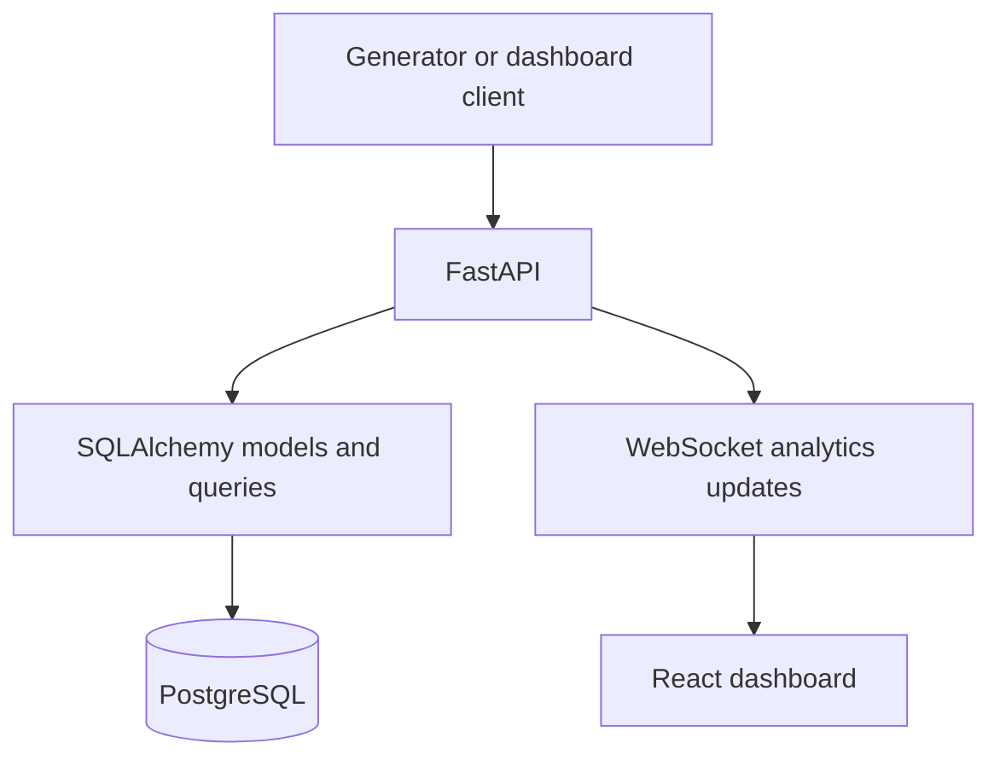

# Real-Time Event Analytics Dashboard

<!-- TODO: Replace this summary with your own project description and add a live demo link if available. -->

A small real-time analytics prototype. A Python event generator sends sample events to a FastAPI backend, which updates in-memory counts and broadcasts snapshots to a React dashboard over a WebSocket connection.

The project is intentionally at its first MVP stage: it demonstrates the event-ingestion and live-update loop without a database or durable storage. Events and analytics are lost when the backend process restarts.

## What It Does

Each event contains a `platform`, `topic`, and `sentiment`. The backend accepts events, keeps them in memory, updates aggregate counts, and sends the latest analytics snapshot to connected browsers. The included generator creates sample Reddit, YouTube, and Twitter events every 0.2 seconds.

Current backend endpoints:

| Method | Path | Purpose |
| --- | --- | --- |
| `GET` | `/health` | Check whether the API is running. |
| `POST` | `/events` | Validate and record one event, then broadcast updated analytics. |
| `GET` | `/events` | Return events held in the in-memory list. |
| `GET` | `/analytics` | Return aggregate event, topic, platform, and sentiment counts. |
| WebSocket | `/ws/analytics` | Send the current snapshot on connect and broadcast subsequent updates. |

Interactive API documentation is available at <http://127.0.0.1:8000/docs> while the backend is running.

## Screenshots

<!-- TODO: Add screenshots under docs/screenshots/ and replace these placeholders with embedded images. -->

<!-- | View | Screenshot |
| --- | --- |
| Live analytics dashboard | Add `docs/screenshots/dashboard.png` |
| WebSocket updates arriving | Add `docs/screenshots/live-updates.png` |
| API documentation | Add `docs/screenshots/api-docs.png` |

Example after adding an image: ``. -->

## Run Locally

Requirements: Python 3.14 or newer (per `pyproject.toml`), Node.js, and npm. Start each part in its own terminal from the repository root.

### 1. Install backend dependencies

```bash
python -m venv .venv
```

Activate the environment:

```powershell
# Windows PowerShell
.\.venv\Scripts\Activate.ps1
```

```bash
# macOS/Linux
source .venv/bin/activate
```

Install the project dependencies with `uv`:

```bash
uv sync
```

Alternatively, install FastAPI and its standard extras into the active environment:

```bash
python -m pip install "fastapi[standard]>=0.141.1"
```

### 2. Start the API

```bash
python -m uvicorn backend.app.main:app --reload
```

The API listens at <http://127.0.0.1:8000>.

### 3. Start the React frontend

In a second terminal:

```bash
cd Frontend
npm install
npm run dev
```

Open the local URL printed by Vite, usually <http://localhost:5173>.

### 4. Generate sample events

In a third terminal, from the repository root:

```bash
python generator/generator.py
```

The dashboard connects to `ws://127.0.0.1:8000/ws/analytics`. Keep the API and generator running while viewing the dashboard. Stop the generator with `Ctrl+C`.

## Architecture

### Current MVP

Will add flow chart here

`backend/app/main.py` creates the FastAPI application and registers the event and analytics routers. `backend/api/events.py` validates incoming payloads with Pydantic, appends them to a module-level list, and asks the analytics module to broadcast an update. `backend/api/analytics.py` maintains process-local counters and connected WebSocket clients. `generator/generator.py` posts fake events, and `Frontend/src/App.jsx` receives WebSocket snapshots and renders the dashboard.

This architecture is intentionally simple for the first MVP. The list and counters are in process memory: they do not survive a restart, are not shared between multiple backend workers, and do not provide database transactions or durable history. The React dashboard is also an early implementation; its cards and some display details remain in progress.

### Planned Database Architecture

After the MVP works end to end, replace the in-memory store with PostgreSQL through SQLAlchemy:



The database work can focus on models, relationships where useful, queries, indexes, and transaction boundaries. Keep the existing in-memory approach until the end-to-end MVP is stable.

## Development Roadmap

The roadmap is deliberately incremental: get one useful version working, then add engineering depth one feature at a time.

### MVP 1: Real-time event loop

- [x] FastAPI accepts event payloads.
- [x] Sample generator posts events.
- [x] Analytics are aggregated in memory.
- [x] WebSocket broadcasts snapshots to the React frontend.
- [ ] Finish and verify the dashboard's metric displays and empty/disconnected states.

### MVP 2: PostgreSQL persistence

Replace the module-level `events = []` store and process-local aggregates with PostgreSQL-backed persistence using SQLAlchemy. Explore model design, any useful relationships, aggregation queries, indexes, and transaction behavior. Keep the model simple if the event data does not need many relationships.

### MVP 3: Automated tests

Add pytest coverage for event creation (`POST /events`), analytics (`GET /analytics`), payload validation, and WebSocket behavior. Include correctness checks for larger input volumes, such as whether aggregates remain correct after 10,000 submitted events.

### MVP 4: Load testing

Use Locust to simulate concurrent virtual users sending events and reading analytics. Measure requests per second, average latency, p95 latency, and error rate. Record the workload and environment alongside results so future comparisons are meaningful.

### MVP 5: Docker

Containerize the React frontend, FastAPI backend, and PostgreSQL database. Add Docker Compose so the complete development stack can be started together, for example with `docker compose up`.

### Later: Redis caching

Consider Redis only after persistence and baseline measurements exist. If analytics queries become expensive, evaluate caching aggregate responses. Document what is cached, the TTL, invalidation behavior when events arrive, and cache hit/miss behavior. Measure the database-backed version first; Redis is optional if it does not solve a demonstrated problem.

## Project Structure

```text
backend/
	app/          FastAPI application setup
	api/          Event and analytics HTTP/WebSocket routes
	models/       Placeholder for database models and configuration
Frontend/
	src/          React application and dashboard components
generator/      Synthetic event producer
```

## Useful Commands

From `Frontend/`:

```bash
npm run build
npm run lint
```

<!-- TODO: Update this section as automated backend tests and load tests are added. -->

<!-- ## License

<!-- TODO: Add a LICENSE file and name the chosen license here. -->

No license has been specified yet. -->